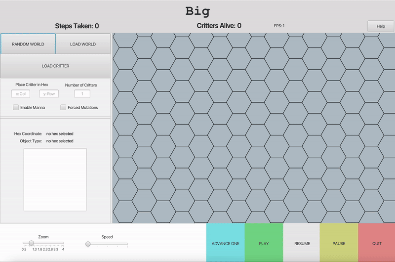
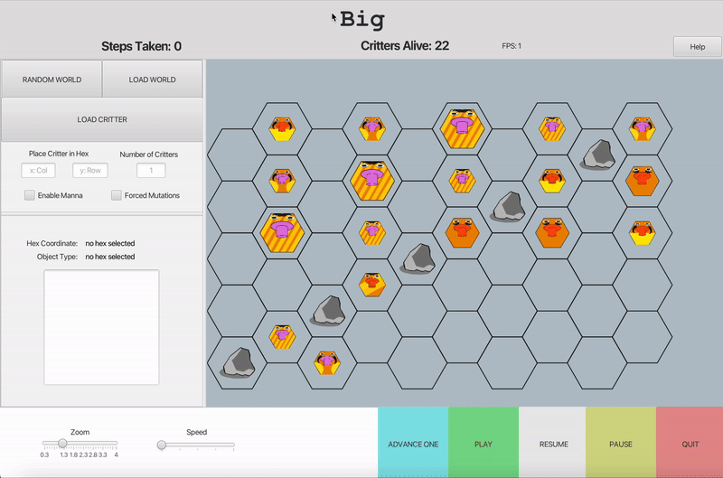
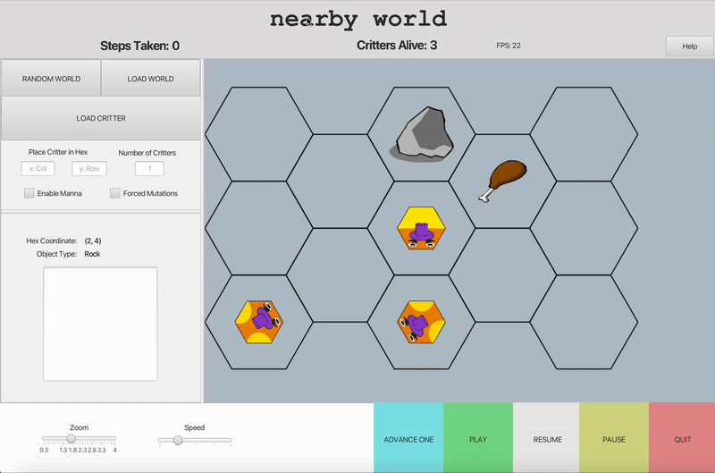

# Critter World: Simulating Evolving Artificial Life

## CS 2112: Honors Object Oriented Design and Data Structures - Cornell University
Created by: Caedy Lee, Sienna Li, Richie Xue, Shaurya Sen

### Revelant Files
- [Project Specifications](https://courses.cs.cornell.edu/cs2112/2024fa/project/project.pdf?1732124197)
- [Example Critter File](https://courses.cs.cornell.edu/cs2112/2024fa/project/example-critter.txt)
- [Example World File](world.txt)
- [Project Grammar](https://courses.cs.cornell.edu/cs2112/2024fa/project/grammar.txt)

## Overview
**Goal:** Simulate and display a world of self-controlling artificial life forms (critters) capable of interacting with each other and the environment.

**3 primary steps:**
1. create a parser for the critter language to store the program in an abstract syntax tree
2. simulate the critter world using a controller and interpreter 
3. build a GUI in JavaFX to display the world and control simulation

**Summary:** Critters exist on a regular hexagonal grid, requiring energy to perform any action (attacking, reproducing, eating, etc). The genome of a critter determines actions they are capable of, defined by a program (written in critter grammar). Please view Project Specifications for more.

_Note: in accordance with Cornell University's Academic Integrity Policy, we are unable to show any of our code._

## Graphical User Interface
Our GUI was written using JavaFX and was designed to enhance both functionality and user experience.

**Functionality**
- Load custom worlds.

- Load custom critters, with the option of choosing its location on the grid.

- Run and control the speed of the simulation.

- View information about chosen hexagons and its contents.

